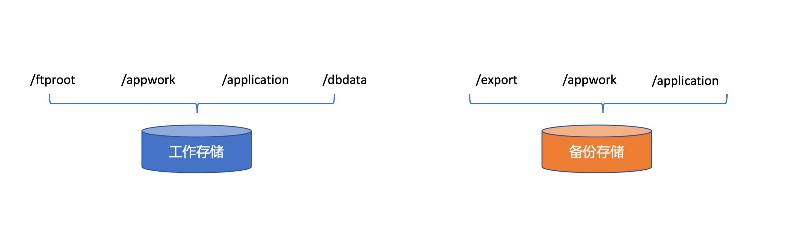

# 经销商原始数据备份策略

每日对经销商原始文件进行备份至备份存储，同时按照每个项目保存时间约定对原存储位置文件进行检查，清除符合要求的清理。工作存储用于日常业务处理，备份存储提供历史数据访问服务，用于历史文件追溯。

## 备份内容

经销商原始文件指以下内容：

- 采集端、DDHUB自动上传的经销商数据
- 客户通过FTP工具自行上传的数据
- 客户通过邮件发送的数据
- 客户通过上传平台上传的数据
- 生产通过网站抓取下载的文件

## 备份流程

在原有FTI数据操作转存的功能上，添加备份操作，在检测到新文件后，同时放入工作目录和备份目录，如存储失败记录错误并发送通知。

>存放至工作目录和备份目录相互无任何依赖关联，任何一方失败不影响另一操作执行，确保在任一磁盘故障时都可以至少有一份数据保存成功。

## 文件清理流程

文件清理采用定时任务方式进行，根据备份策略每月一次定时触发，对超过备份时间的文件进行删除处理。

> 在删除前需确认文件已备份完成，如未能备份成功则提交则暂不删除，加入异常处理列表中等待后续人工介入处理

## 文件备份清理策略

文件备份策略按照厂商分别制定，以下未已制定的策略的厂商，其余其余暂时不进行清理工作，暂时未制定默认策略。

- 华润三九：保留当前月及前三个完整月数据
- wy（买咳嗽药那个）：保留当前月及前三个完整月数据
- 紫竹：保留当前月及前三个完整月数据

### 存储划分

工作存储划分为4个根挂载点：

- /ftproot:提供给ftp服务使用，用于存储未被系统抓取处理的经销商原始文件及交付给药厂的处理数据
- /appwork:FIT系统抓取上传文件存放的工作目录，用于后续DAS文件处理，异议符合等功能使用
- /application:提供给应用服务用于存放应用需持久化存储的文件对象，下面可根据服务添加子挂载点。
- /dbdata:提供给mysql，redis，kafka等数据服务持久化存储，下面可根据服务添加子挂载点。

备份存储划分为三个挂载点：

- /export:用于备份所有交付数据，包括ftp交付的数据和邮件交付数据
- /appwork:用于备份工作存储中/appwork内容，所有内容与工作节点一致，在写入工作存储的同时写入备份存储
- /application:用于备份所有/application中应用使用的持久化数据

数据库数据的备份统一备份到数据库专用备份存储不在此处进行备份。备份存储主要针对文件级别的数据进行备份。

### 存储空间划分

工作存储划分

|挂载点|最大存储|初始化大小|需求描述|
|---|---|---|---|
|ftproot|*2T*|*1T*|需满足存放2年交付数据及未处理上传文件需求|
|appwork|*6T*|*3T*|满足存放半年原始文件需求|
|application|*2T*|*500GB*|满足程序需持久化存储的文件|
|dbdata|*4T*|*1T*|满足数据业务模块独立数据库存储使用|
|**总计**|**14T**|||
>容量规模按照一倍现有需求设计，所有挂载点设计为可扩容模式，后期可增加设备进行扩容
