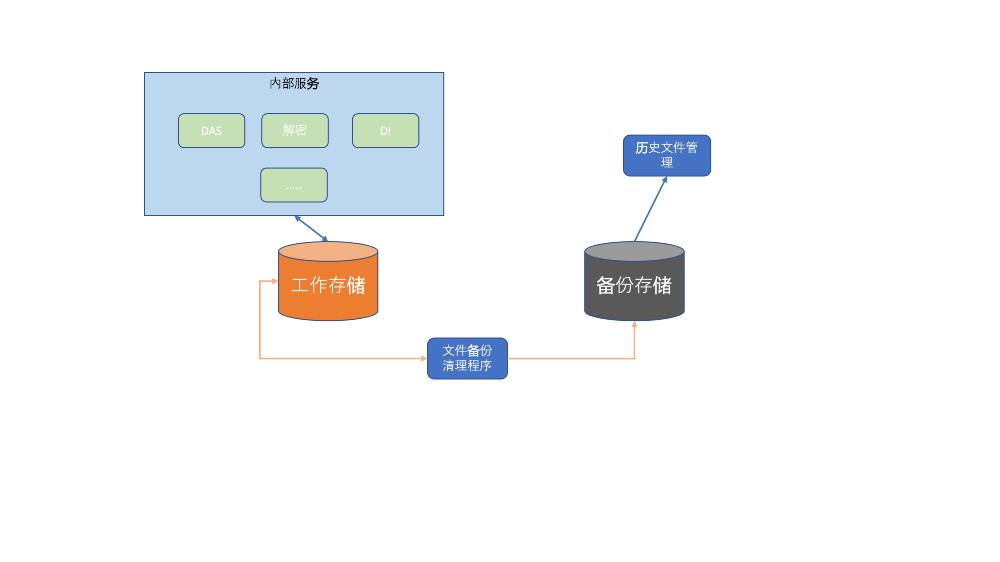
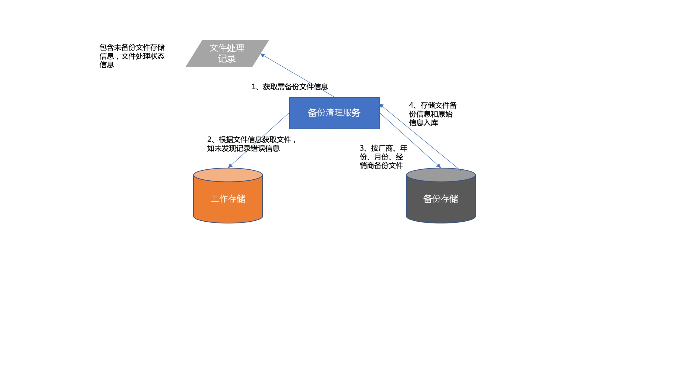

# 经销商原始数据备份策略

每日对经销商原始文件进行备份至备份存储，同时按照每个项目保存时间约定对原存储位置文件进行检查，清除符合要求的清理。工作存储用于日常业务处理，备份存储提供历史数据访问服务，用于历史文件追溯。

## 备份内容

经销商原始文件指以下内容：

- 采集端、DDHUB自动上传的经销商数据
- 客户通过FTP工具自行上传的数据
- 客户通过邮件发送的数据
- 客户通过上传平台上传的数据
- 生产通过网站抓取下载的文件

## 备份流程

1. 首先从待备份清单中获取文件存储位置和处理状态
2. 根据文件信息到工作存储中查找文件，采用拷贝方式在备份存储新建文件，如未发现文件或拷贝发生错误，记录错误信息
3. 将文件按照厂商->年份->月份->经销商->交付类型的方式重新组织文件存储路径
4. 备份完成后记录备份文件信息和文件原始信息入库

## 文件清理流程

文件清理采用定时任务方式进行，根据备份策略每月一次定时触发，对超过备份时间的文件进行删除处理。

> 在删除前需确认文件已备份完成，如未能备份成功则提交则暂不删除，加入异常处理列表中等待后续人工介入处理

## 文件备份清理策略

文件备份策略按照厂商分别制定，以下未已制定的策略的厂商，其余其余暂时不进行清理工作，暂时未制定默认策略。

### 华润三九

在工作存储中保存近三个月DAS标记为已转出的原始文件和每月26号至月底的所有原有文件
