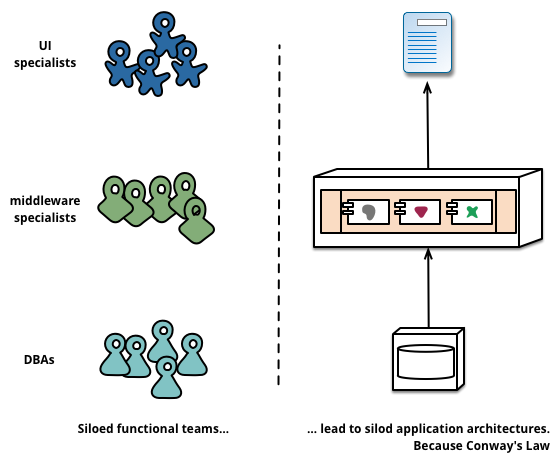

# Microserver 概念说明

“微服务架构”一词在过去几年里广泛的传播，它用于描述一种独立部署的软件应用设计方式。这种架构方式并没有非常准确的定义，但是在业务能力、自动部署、端对端的整合、对语言及数据的分散控制上，却有着显著特征。

“微服务”----只不过在满大街充斥的软件架构中的一新名词而已。尽管我们非常鄙视这样的东西，但是这玩意所描述的软件风格，越来越引起我们的注意。在过去几年里，我们发现越来越多的项目开始使用这种风格，以至于我们身边的同事在构建企业应用时，把它理所当然的认为这是一种默认开发形式。然而，很不幸，微服务风格是什么，应该怎么开发，关于这样的理论描述却很难找到。

简而言之，微服务架构风格，就像是把小的服务开发成单一应用的形式，每个应用运行在单一的进程中，并使用如HTTP这样子的轻量级的API。这些服务满足某需求，并使用自动化部署工具进行独立发布。这些服务可以使用不同的开发语言以及不同数据存储技术，并保持最低限制的集中式管理。

## monolithic style(整体服务风格)

开始介微服务风格前，先介绍整体风格：即把一个完整的应用当成一开发单元。企业应用通常包含三个部分：客户端界面（由HTML、Javascript组成，使用浏览器进行访问）、数据库（由许多的表组件构成一个通用的、相互关联的数据管理系统）、服务端应用。服务端应用处理HTTP请求、执行领域逻辑、检索并更新数据库中的数据、使用适当的HTML视图发送给客户端。服务端应用是完整的 ---- 由单一的逻辑层次执行。系统中任务变更都会导到服务端的应用重新编辑并发布一个新的版本。

这样的整体服务是这样的构建系统的很自然的方式。虽然利用开发语基础特性会把应用封装成类、函数、命名空间，但是业务中所有逻辑都要在单一的进程中处理完成。在某些场景中，开发者可能在的笔计本中开发、测试应用，然后利用部署通道来保证经过正常测试、发布的修改内容正确的发布的产品中。也可以使用横向扩展，通过负载均横系统将事个应用部署到多台服务器上。
整体风格的应用也是相当成功的，但是越来越多的人感觉到有点不妥，特别是在云中进行应用的发布时。变更发布周期被绑定了 ---- 原来可以划分成小的应用、小的需要的变更，需要统一的进行编译和发布。随着时间的推移，人们通常难于维护一种优美的模块化的结构，使得一个模块的变更很难不会影响到其它的模块。进行扩展，也需要进行整体的扩展，而不能根据进行部分的扩展。

## 微服务架构特征

我们不能说这是微服务架构风格的标准定义，但是我们可以尝试描述一下我们看见的一些合适这个标签的通用架构特征。

### 组件化服务

自我们进入软件产业就期望通过组件插拔的方式构建系统，在现实世界中我们见到很多事物通过类似的方式制造。在过去的几十年里，我们已经看到了大部分语言平台的公共库的进行了精简，并取得可观的进展。

当我们谈论组件的时候，有可能会因为组件的不同定义引起混乱。因此我们申明，这里谈到的组件是指软件中独立的单元，它能独立替代和独立更新。

 微服务架构也使用组件库，但是它把软件拆分成服务，并认为这是主要的组织形式。我们把组件库定义为程序中相互关系、并使用内存中调用的组件，把服务定义为进程间使用如Web请求服务或者远程调用来相互通信的组件。（这种定义的方式与其它面向对象程序中服务对象的概念是不一样的。）

把服务当成组件（而不是组件库）一个主要的原因是服务可以独立的部署。如果你的应用由多个组件库组成并跑在一个进程中，那么任何组件的变更都将导致整体应用的重新发布。但是如果由许多服务构成的应用，你可以想像的到每个服务的变更仅需要发布相应的服务。当然，这也不是绝对的，比如导致服务接口的变更的更新就需要相应服务的变化，但优秀微服务构架，会尽量避免这种服务间的耦合并完善服务的交互接口。

把服务当成组件的另一个考虑是这将拥有更新清晰的接口。许多开发语言并没有良好的定义公共接口的机制。通常只有文档和规范说明，让用户避免组件间会导致组件耦合的过度的依赖。不过服务由是是通过明确的远程接口调用，这个问题就很容易解决了。
使用服务也有它的不足之处。远程调用比进制内部调用更消耗性能，而且远程的API比较粗糙，难以使用。如果由于对组件的职责进行变更，影响到跨进程间的交互，那么这操作起来也比较困难。

第一个可能的特性，我们看到每个服务是运行在独立的进程上的。注意，这只是第一个可能的特性。服务也可以由多个进程组成，它们是同时开发和部署的，例如服务可能用到一个应用进程和一个数据库进程。

### 围绕业务能力组织

当把一个大型应用分割成小的部件时，通常的管理焦点在技术层面上，拆分为前端、服务端和数据库端团队。使用这种组织结构，即时很小的变更都将导致跨团队的沟通和预算审批。一个高效的团队会针对这种情况进行改善，关注它们所涉及的应用逻辑，并从中做出较好的选择。换句话说，逻辑无处不在。Conway's Law的实践就是一个例子。

>Any organization that designs a system(defined broadly) will produce a design whose structure is a copy of the organization's communication structure.     --Melvyn Conway.1967

>组织设计产生的系统架构和组织的沟通架构相同，什么样的团队结构产生什么样的系统。

微服务更倾向于围绕业务功能对服务结构进行划分、拆解。这样的服务，是针对业务领域有着关完整实现的软件，它包含使用接口、持久存储、以及对旬的交互。因此团队应该是跨职能的，包含完整的开发技术：用户体验、数据库、以及项目管理。

大型的整体型应用也可以按照业务功能进行模块化的，尽管这种例子不常见。当然，我们敦促一个大型的团队将一个构建成整体型的应用依照业务功能进行拆分。我们能看到主要问题在于，这种组件形式会导致很多的上下文依赖。如果在大量的模块边界上都存在这种大量的调用，对于团队的每个成员来说，短期内是很难记住的。此外，我们发现模块化方式需要大量的规范去强制执行，当然，大量明确的拆分也让服务组件在团队的边界中更加清晰。

### 产品不是项目

大部分的软件开发者都使用这样的开发模式：至力于提供一些被认为是完整的软件。一旦开发完成，软件将移交给维护部门，然后，开发组就可以解散掉了。

微服务的支持者认为，这种做法是不可取的，并提议开发组应该负责产品的整个生命周期。一个常见的证明是：Amazon的“你编译，你运维（you build, you run it）”的理念，它要求开发团队对软件产品的整个生命周期负责。这要求开发者每天都关注软件产品的运行情况，并与用户联系的更紧密，同时承担一些售后支持。

成熟的产品会与业务功能进行绑定。除了把软件看成既定功能的集合外，会进一步关心“软件如何帮助用户实现业务功能”这样的问题。
采用整体型的架构并不是没有原因的，但是越小的服务粒度越容易促进用户与服务提供商之前的关系。

### Smart endpoint and dumb pipes

当构建不同的进程间通信机制的时候，我们发现有许多的产品和方法能够把更加有效方法强加入的通信机制中。比如企业服务总线（ESB），这样的产品提供更有效的方式改进通信过程中的路由、编码、传输、以及业务处理规则。

微服务倾向于做如下的选择：强化终端及弱化通道。微服务的应用致力松耦合和高内聚：采用单独的业务逻辑，表现的更像经典Unix意义上的过滤器一样，接受请求、处理业务逻辑、返回响应。它们更喜欢简单的REST风格，而不是复杂的协议，如WS或者BPEL或者集中式框架。

有两种协议最经常被使用到：包含资源API的HTTP的请求-响应和轻量级消息通信协议。最为重要的建议为：
>Be of the web, not behind the web(善于利用网络，而不是限制使用网络。)
>
>---- Ian Robinson

微服务团队采用这样的原则和规范：基于互联网（广义上，包含Unix系统）构建系统。这样经常使用的资源几乎不用什么的代价就可以被开发者或者运行商缓存。

第二种做法是通过轻量级消息总线来发布消息。这种的通信协议非常的单一（单一到只负责消息路由），像RabbitMQ或者ZeroMQ这样的简单的实现甚至像可靠的异步机制都没提供，以至于需要依赖产生或者消费消息的终端或者服务来处理这类问题。

在整体工风格中，组件在进程内执行，进程间的消息通信通常通过调用方法或者回调函数。从整体式风格到微服务框架最大的问题在于通信方式的变更。从内存内部原始的调用变成远程调用，产生的大量的不可靠通信。因此，你需要把粗粒度的方法成更加细粒度的通信。

### 分散治理（去中心化治理）

集中治理的一种好处是在单一平台上进行标准化。经验表明这种趋势的好处在缩小，因为并不是所有的问题都相同，而且解决方案并不是万能的。我们更加倾向于采用适当的工具解决适当的问题，整体式的应用在一定程度上比多语言环境更有优势，但也适合所有的情况。

把整体式框架中的组件，拆分成不同的服务，我们在构建它们时有更多的选择。你想用Node.js去开发报表页面吗？做吧。用C++来构建时时性要求高的组件？很好。你想以在不同类型的数据库中切换，来提高组件的读取性能？我们现在有技术手段来实现它了。

当然，你是可以做更多的选择，但也不意味的你就可以这样做，因为你的系统使用这种方式进行侵害意味着你已经有的决定。

采用微服务的团队更喜欢不同的标准。他们不会把这些标准写在纸上，而是喜欢这样的思想：开发有用的工具来解决开发者遇到的相似的问题。这些工具通常从实现中成长起来，并进行的广泛范围内分享，当然，它们有时，并不一定，会采用开源模式。现在开源的做法也变得越来越普遍，git或者github成为了它们事实上的版本控制系统。
Netfix就是这样的一个组织，它是非常好的一个例子。分享有用的、尤其是经过实践的代码库激励着其它的开发着也使用相似的方式来解决相似的问题，当然，也保留着根据需要使用不同的方法的权力。共享库更关注于数据存储、进程内通信以及我们接下来做讨论到的自动化等这些问题上。

微服务社区中，开销问题特别引人注意。这并不是说，社区不认为服务交互的价值。相反，正是因为发现到它的价值。这使得他们在寻找各种方法来解决它们。如[Tolearant Reader](https://martinfowler.com/bliki/TolerantReader.html)和[Consumer-Driven Contracts](https://martinfowler.com/articles/consumerDrivenContracts.html)这样的设计模式就经常被微服务使用。这些模式解决了独立服务在交互过程中的消耗问题。使用Consumer-Driven Contracts增加了你的信心，并实现了快速的反馈机制。事实上，我们知道澳大利亚的一个团队致力使用Consumer-Drvien Contracts开发新的服务。他们使用简单的工程，帮助他们定义服务的接口。使得在新服务的代码开始编写之前，这些接口就成为自动化构建的一个部分。构建出来的服务，只需要指出这些接口适用的范围，一个优雅的方法避免了新软件中的'YAGNI '困境。这些技术和工具在使用过程中完善，通过减少服务间的耦合，限制了集中式管理的需求。

也许分散治理普及于亚马逊“编译它，运维它”的理念。团队为他们开发的软件负全部责任，也包含7*24小时的运行。全责任的方式并不常见，但是我们确实发现越来越多的公司在他们的团队中所推广。Netfix是另外一个接受这种理念的组件。每天凌晨3点被闹钟吵醒，因为你非常的关注写的代码质量。这在传统的集中式治理中这是一样多么不思议的事情呀。

### 分散数据治理

 对数据的分散管理有多种不同的表现形式。在抽象层面，它意味着不同系统中的概念模型是不同的。这带来的问题是大型的跨系统整合时，销售视角中的客户与售后视角中是不同的样子。在销售中调用客户模型可能有一些属性不会再售后视图中出现。在不同的业务中可能有这不同的属性和一些公共属性。

应用之间这个问题很普遍，但应用内部这个问题也存在，特别是当应用拆分成不同的组件时。对待这个问题非常有用的方式为[Bounded Context](https://martinfowler.com/bliki/BoundedContext.html)的领域驱动设计。DDD把复杂的领域拆分成不同上下文边界以及它们之间的关系。这样的过程对于整体架构和微服务框架都很有用，但是服务间存在着明显的关系，帮助我们对上下文边界进行区分，同时也像我们在业务功能中谈到的，强行拆分。

当对概念模式下决心进行分散管理时，微服务也决定着分散数据管理。当整体式的应用使用单一逻辑数据库对数据持久化时，企业通常选择在应用的范围内使用一个数据库，这些决定也受厂商的商业权限模式驱动。微服务让每个服务管理自己的数据库：无论是相同数据库的不同实例，或者是不同的数据库系统。这种方法叫[Polyglot Persistence](https://martinfowler.com/bliki/PolyglotPersistence.html)。你可以把这种方法用在整体架构中，但是它更常见于微服务架构中。

微服务分散数据任意味着数据在跨服务时需要隐式的进行数据更新。处理数据更新的常用方法是使用事务来保证不同的资源修改数据库的一致性。这种方法通常在整体架构中使用。

使用事务是因为它能够帮助处理一至性问题，但对时间的消耗是严重的，这给跨服务操作带来难题。分布式事务非常难以实施，因此微服务架构[强调服务间事务的协调](http://www.eaipatterns.com/ramblings/18_starbucks.html)，并清楚的认识一致性只能是**最终一致性**以及通过补偿运算处理问题。

选择处理不一致问题对于开发团队来说是新的挑战，但是也是一个常见的业务实践模式。通常业务上允许一定的不一致以满足快速响应的需求，但同时也采用一些恢复的进程来处理这种错误。当业务上处理强一致性消耗比处理错误的消耗少时，这种付出是值的的。

### 基础设施自动化

基础设施自动化技术在过去几年中得到了长足的发展：云计算，特别是AWS的发展，减少了构建、发布、运维微服务的复杂性。

许多使用微服务架构的产品或者系统，它们的团队拥有丰富的持集部署以及它的前任持续集成的经验。团队使用这种方式构建软件致使更广泛的依赖基础设施自动化技术。下图说明这种构建的流程：

尽管这不是介绍自动部署的文章，但我们也打算介绍一下它的主要特征。我们希望我们的软件应该这样方便的工作，因此我们需要更多的自动化测试。流程中工作的软件改进意味着我们能自动的部署到各种新的环境中。

整体风格的应用相当开心的在各种环境中构建、测试、发布。事实证明，一旦你打算投资一条整体架构应用自动化的的生产线，那么你会发现发布更多的应用似乎非不那么的可怕。记住，CD（持续部署）的一个目标在于让发布变得无趣，因此无论是一个还是三个应用，它都一样的无趣。

另一个方面，我们发现使用微服务的团队更加依赖于基础设施的自动化。相比之下，在整体架构也微服务架构中，尽管发布的场景不同，但发布工作的无趣并没有多大的区别。

### 容错性设计

使用服务作为组件的一个结果在于应用需要有能容忍服务的故障的设计。任务服务可能因为供应商的不可靠而故障，客户端需要尽可能的优化这种场景的响应。跟整体构架相比，这是一个缺点，因为它带来的额外的复杂性。这将让微服务团队时刻的想到服务故障的情况下用户的体验。Netflix的Simian Army可以为每个应用的服务及数据中心提供日常故障检测和恢复。

这种产品中的自动化测试可以让大部分的运维团队正常的上下班。这并不意味着整体构架的应用没有这么精巧的监控配置，只是在我们的经验中它并不常见。
由于服务可以随时故障，快速故障检测，乃至，自动恢复变更非常重要。微服务应用把实时的监控放在应用的各个阶段中，检测构架元素（每秒数据库的接收的请求数）和业务相关的指标（把分钟接收的定单数）。监控系统可以提供一种早期故障告警系统，让开发团队跟进并调查。

对于微服务框架来说，这相当重要，因为微服务相互的通信可能导致紧急意外行为。许多专家车称赞这种紧急事件的价值，但事实是这种紧急行为有时是灾难。监控是至关重要的，它能快速发现这种紧急不良行为，让我们迅速修复它。

整体架构，跟微服务一样，在构建时是通明的，实情上，它们就是这样子的。它们不同之处在于，你需要清楚的认识到不同进程间运行的服务是不相关的。库对于同一进程是透明的，也因此不那么重要了。

微服务团队期望清楚的监控和记录每个服务的配置，比如使用仪表盘显示上/下线状态、各种运维和业务相关的指标。对断路器（circuit breaker）状态、目前的吞吐量和时延细节，我们也会经常遇到。

### 设计改进

微服务实践者，通常有不断改进设计的背景，他们把服务分解成进一步的工具。这些工具可以让应用开发者在不改变速度情况下，控制都他们的应用的需求变更。变更控制不意味首减少变更，而是使用适当的方式和工具，让它更加频繁，至少，很好让它变得可控。

不论如何，当你试图软件系统拆分成组件时，你将面临着如何拆分的问题。那么我们的决定拆分我们应用的原则是什么呢？首要的因素，组件可以被独立替换和更新的，这意味着我们寻找的关键在于，我们要想象着重写一个组件而不影响它们之前的协作关系。事实上，许多的微服务小组给它进一步的预期：服务应该能够报废的，而不是要长久的发展的。

Guardian网站就是这方面的一个优秀的例子，它初期被设计和构建成一个整体架构，但它已经向微服务的发展了。整体构架仍然是它网站的核心，但是他们使用微服务来增加那些使用整体架构API的新特性。这种方法增加这些临时的特性非常方便，比如运动新闻的特稿。这样站点的一个部分可以使用快速的开发语言迅速整合起来，当它过时后可以一次性移除。我们发现一家金融机构用相似的方法增加新的市场营销活动，数周或者几个月后把它撤销。

可代替是模块化开发中的一个特例，它是用模块来应对需要变更的。你希望让变更是相同模块，相同周期中进行变化而已。系统的某些很小做变更部分，也应该放在不同的服务中，这样它们更容易让它们消亡。如果你发现两个服务一直重复的变更时，这就是一个要合并它们的信号了。

把组件改成服务，增加了细化发布计划的一个机会。整体构架的任务变更需要整个应用的完整的构建和发布。然而，使用微服务，你只需要发布你要修改的服务就可以了。这将简化和加速你的发布周期。缺点是你需要为一个变更服务发布可能中断用户的体验而担心。传统的集成方法是使用版本来处理这些问题，但是微服务版本仅是最后的通告手段。我们需要在设计服务时尽可能的容忍供应商的变更，以避免提供多个版本。

原文参考:[https://martinfowler.com/articles/microservices.htm](https://martinfowler.com/articles/microservices.html)
